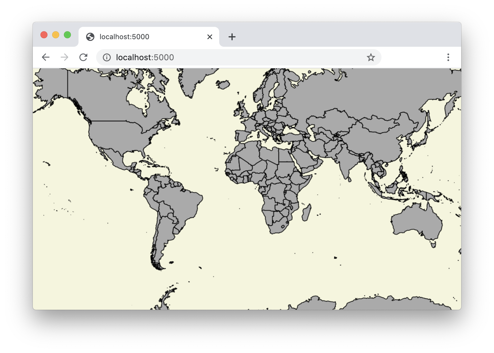

# tilet

This is meant to serve as an example of how little code is required to put together a map client based on a well structured tiles representing geographic data.

<p align="center">
  
</p>

```html
    <div id="map"></div>
    <script
      src="./tilet.js"
      data-map="map"
      data-tiles="./examples/countries.json"
      data-tile-matrix-set="WebMercatorQuad"
      data-values="styleId=polygon"
      data-center="0, 0"
      data-zoom="2"
    ></script>
```

The client works with services that implement the evolving [OGC API - Tiles](https://github.com/opengeospatial/OGC-API-Tiles) specification.  In its initial form, the client is < 200 [lines of code](./tilet.js) and has zero dependencies.  It doesn't do much, but it is capable of parsing the metadata docs and rendering tiles based on any configured tile matrix (in any coordinate reference system, with non-uniform tile sizes, etc.).

Two things about that draft spec makes the implementation of a lightweight client unnecessarily hard.

1. The spec requires that each level in a tile matrix set is described by a `scaleDenominator`.  What a client needs is the "resolution" (or map units per pixel) for each level.  The formula for calculating the resolution looks something like this:

    ```
    resolution = scaleDenominator * 0.00028 * metersPerUnit
    ```

   While this looks straightfoward enough, it has two awkward parts:

   a. `0.00028`.  This one is minor, but it is a tripping point.  This number comes from the [OGC Symbology Encoding](https://www.ogc.org/standards/symbol) specification which says

   > The “standardized rendering pixel size” is defined to be 0.28mm × 0.28mm (millimeters).

   If you discover that these two specifications are related, and read carefully enough, you'll find this magic number.

   b. `metersPerUnit`.  This is where the unnecessary dependencies come in.  The client needs to know the units of the coordinate reference system for the tile set and how those units relate to meters.  For angular units (e.g. radian or degree), the client will also need to know the semi-major axis of the ellipsoid used by the coordinate reference system.  The identifiers for these coordinate reference system come in a number of flavors.  Newer ones look like http://www.opengis.net/def/crs/OGC/1.3/CRS84 or http://www.opengis.net/def/crs/EPSG/0/3857, but there is abundant variety in their forms.  Requiring that all tile clients can determine the `metersPerUnit` for an arbitrary coordinate reference system identifier is an unnecessary burden.

2. The spec describes the origin of a tile set with a `topLeftCorner` property.  Values for this property are two item arrays like `[90, -180]`, `[-180, 90]`, or `[-2.00375083427892E7, 2.0037508E7]`.  The challenge here is similar to the point above.  To know which of the two numbers refers to "top" and which refers to "left", you need to know the axis order of the coordinate reference system for the tile set.  This too can be solved by depending on additional libraries and databases, but it is an unnecessary complexity.

The solution to the first issue is to specify that tile sets advertise `resolution` (map units per pixel) instead of `scaleDenominator`.

The solution to the second issue is to specify that tile sets advertise separate `top` and `left` properties representing the origin (instead of one `topLeftCorner` where the order of the values must be retrieved from elsewhere).

I've taken the liberty of modifying the metadata documents for the [example](./examples) tile set used here so that they include `resolution` instead of `scaleDenominator` and `top` plus `left` instead of `topLeftCorner`.

Here is an example of what that change looks like for one level in a `WorldCRS84Quad` tile matrix set:

```diff
diff --git a/examples/WorldCRS84Quad.json b/examples/WorldCRS84Quad.json
index cd02619..0213968 100644
--- a/examples/WorldCRS84Quad.json
+++ b/examples/WorldCRS84Quad.json
@@ -13,11 +13,9 @@
   "tileMatrix": [
     {
       "identifier": "0",
-      "scaleDenominator": 279541132.0143589,
-      "topLeftCorner": [
-        90,
-        -180
-      ],
+      "resolution": 0.703125000000000,
+      "top": 90.0,
+      "left": -180.0,
       "tileWidth": 256,
       "tileHeight": 256,
       "matrixWidth": 2,
```

Minor difference, but it means a zero-dependency, lightweight client is possible.
